<p align="center">
  <picture>
    <source media="(prefers-color-scheme: dark)" srcset="assets/logo-with-text-dark.svg">
    <source media="(prefers-color-scheme: light)" srcset="assets/logo-with-text-light.svg">
    
  </picture>
</p>

<p align="center"><strong>Your books deserve a home. This is it.</strong></p>

<p align="center">
BookLore is a self-hosted app that brings your entire book collection under one roof.<br/>
Organize, read, annotate, sync across devices, and share, all without relying on third-party services.
</p>

<p align="center">
  <a href="https://github.com/booklore-app/booklore/releases"></a>
  <a href="LICENSE"></a>
  <a href="https://hub.docker.com/r/booklore/booklore"></a>
  <a href="https://github.com/booklore-app/booklore/stargazers"></a>
  <a href="https://discord.gg/Ee5hd458Uz"></a>
  <a href="https://opencollective.com/booklore"></a>
  <a href="https://hosted.weblate.org/engage/booklore/"></a>
</p>

<p align="center">
  <a href="https://booklore.org/">🌐 Website</a> ·
  <a href="https://booklore.org/docs/getting-started">📖 Docs</a> ·
  <a href="#🎮-live-demo">🎮 Demo</a> ·
  <a href="#🚀-quick-start">🚀 Quick Start</a> ·
  <a href="https://discord.gg/Ee5hd458Uz">💬 Discord</a>
</p>

<p align="center">
  
</p>

---

## ✨ Features

| | Feature | Description |
|:---:|:---|:---|
| 📚 | **Smart Shelves** | Custom and dynamic shelves that organize themselves with rule-based Magic Shelves, filters, and full-text search |
| 🔍 | **Automatic Metadata** | Covers, descriptions, reviews, and ratings pulled from Google Books, Open Library, and Amazon, all editable |
| 📖 | **Built-in Reader** | Open PDFs, EPUBs, and comics right in the browser with annotations, highlights, and reading progress |
| 🔄 | **Device Sync** | Connect your Kobo, use any OPDS-compatible app, or sync progress with KOReader. Your library follows you everywhere |
| 👥 | **Multi-User Ready** | Individual shelves, progress, and preferences per user with local or OIDC authentication |
| 📥 | **BookDrop** | Drop files into a watched folder and BookLore detects, enriches, and queues them for import automatically |
| 📧 | **One-Click Sharing** | Send any book to a Kindle, an email address, or a friend instantly |

---

## 🚀 Quick Start

> [!TIP]
> Looking for OIDC setup, advanced config, or upgrade guides? See the [full documentation](https://booklore.org/docs/getting-started).

All you need is [Docker](https://docs.docker.com/get-docker/) and [Docker Compose](https://docs.docker.com/compose/install/).

<details>
<summary><strong>📦 Image Repositories</strong></summary>

| Registry | Image |
|----------|-------|
| Docker Hub | `booklore/booklore` |
| GitHub Container Registry | `ghcr.io/booklore-app/booklore` |

> Legacy images at `ghcr.io/adityachandelgit/booklore-app` remain available but won't receive updates.

</details>

### Step 1: Environment Configuration

Create a `.env` file:

```ini
# Application
APP_USER_ID=1000
APP_GROUP_ID=1000
TZ=Etc/UTC

# Database
DATABASE_URL=jdbc:mariadb://mariadb:3306/booklore
DB_USER=booklore
DB_PASSWORD=ChangeMe_BookLoreApp_2025!

# Storage: LOCAL (default) or NETWORK (for NFS/SMB, disables file reorganization)
DISK_TYPE=LOCAL

# MariaDB
DB_USER_ID=1000
DB_GROUP_ID=1000
MYSQL_ROOT_PASSWORD=ChangeMe_MariaDBRoot_2025!
MYSQL_DATABASE=booklore
```

### Step 2: Docker Compose

Create a `docker-compose.yml`:

```yaml
services:
  booklore:
    image: booklore/booklore:latest
    # Alternative: ghcr.io/booklore-app/booklore:latest
    container_name: booklore
    environment:
      - USER_ID=${APP_USER_ID}
      - GROUP_ID=${APP_GROUP_ID}
      - TZ=${TZ}
      - DATABASE_URL=${DATABASE_URL}
      - DATABASE_USERNAME=${DB_USER}
      - DATABASE_PASSWORD=${DB_PASSWORD}
    depends_on:
      mariadb:
        condition: service_healthy
    ports:
      - "6060:6060"
    volumes:
      - ./data:/app/data
      - ./books:/books
      - ./bookdrop:/bookdrop
    healthcheck:
      test: wget -q -O - http://localhost:6060/api/v1/healthcheck
      interval: 60s
      retries: 5
      start_period: 60s
      timeout: 10s
    restart: unless-stopped

  mariadb:
    image: lscr.io/linuxserver/mariadb:11.4.5
    container_name: mariadb
    environment:
      - PUID=${DB_USER_ID}
      - PGID=${DB_GROUP_ID}
      - TZ=${TZ}
      - MYSQL_ROOT_PASSWORD=${MYSQL_ROOT_PASSWORD}
      - MYSQL_DATABASE=${MYSQL_DATABASE}
      - MYSQL_USER=${DB_USER}
      - MYSQL_PASSWORD=${DB_PASSWORD}
    volumes:
      - ./mariadb/config:/config
    restart: unless-stopped
    healthcheck:
      test: [ "CMD", "mariadb-admin", "ping", "-h", "localhost" ]
      interval: 5s
      timeout: 5s
      retries: 10
```

### Step 3: Launch

```bash
docker compose up -d
```

Open **http://localhost:6060**, create your admin account, and start building your library.

---

## 🎮 Live Demo

See BookLore in action before deploying your own instance.

| | |
|:---|:---|
| 🌐 **URL** | **[demo.booklore.org](https://demo.booklore.org)** |
| 👤 **Username** | `booklore` |
| 🔑 **Password** | `9HC20PGGfitvWaZ1` |

> [!NOTE]
> This is a standard user account. Admin features like library creation, user management, and system settings are only available on your own instance.

---

## 📥 BookDrop: Zero-Effort Import

Drop book files into a folder. BookLore picks them up, pulls metadata, and queues everything for your review.

```mermaid
graph LR
    A[📁 Drop Files] --> B[🔍 Auto-Detect]
    B --> C[📊 Extract Metadata]
    C --> D[✅ Review & Import]
```



| Step | What Happens |
|:---|:---|
| 1. **Watch** | BookLore monitors the BookDrop folder around the clock |
| 2. **Detect** | New files are picked up and parsed automatically |
| 3. **Enrich** | Metadata is fetched from Google Books and Open Library |
| 4. **Import** | You review, tweak if needed, and add to your library |

Mount the volume in `docker-compose.yml`:

```yaml
volumes:
  - ./bookdrop:/bookdrop
```

---

## 🤝 Community & Support

| | |
|:---|:---|
| 🐞 **Something not working?** | [Report a Bug](https://github.com/booklore-app/booklore/issues/new?template=bug_report.yml) |
| 💡 **Got an idea?** | [Request a Feature](https://github.com/booklore-app/booklore/issues/new?template=feature_request.yml) |
| 🛠️ **Want to help build?** | [Contributing Guide](CONTRIBUTING.md) |
| 💬 **Come hang out** | [Discord Server](https://discord.gg/Ee5hd458Uz) |

---

## 💜 Support BookLore

BookLore is free, open source, and built with care. Here's how you can give back:

| Action | How |
|:---|:---|
| ⭐ **Star this repo** | It's the simplest way to help others find BookLore |
| 💰 **Sponsor development** | [Open Collective](https://opencollective.com/booklore) funds hosting, testing, and new features |
| 📢 **Tell someone** | Share BookLore with a friend, a subreddit, or your local book club |

> [!IMPORTANT]
> We're raising funds for a Kobo device to build and test native Kobo sync support.
> [Contribute to the Kobo Bounty →](https://opencollective.com/booklore/projects/kobo-device-for-testing)

---

## 🌍 Translations

BookLore is used by readers around the world. Help make it accessible in your language on [Weblate](https://hosted.weblate.org/engage/booklore/).

<a href="https://hosted.weblate.org/engage/booklore/">
  
</a>

---

## 📊 Project Analytics


### ⭐ Star History

<a href="https://www.star-history.com/#booklore-app/booklore&type=date&legend=top-left">
 <picture>
   <source media="(prefers-color-scheme: dark)" srcset="https://api.star-history.com/svg?repos=booklore-app/booklore&type=date&theme=dark&legend=top-left" />
   <source media="(prefers-color-scheme: light)" srcset="https://api.star-history.com/svg?repos=booklore-app/booklore&type=date&legend=top-left" />
   
 </picture>
</a>

---

## 👥 Contributors

[](https://github.com/booklore-app/booklore/graphs/contributors)

Every contribution matters. [See how you can help →](CONTRIBUTING.md)

---

<div align="center">

## 🌟 Sponsors & Partners

<table>
<tr>
<td align="center" width="33%">

<a href="https://www.pikapods.com/pods?run=booklore">
  
</a>

**PikaPods**

</td>
<td align="center" width="33%">

<a href="https://docs.elfhosted.com/app/booklore">
  
</a>

**ElfHosted**

</td>
<td align="center" width="34%">

<a href="https://jb.gg/OpenSource">
  
</a>

**JetBrains**

</td>
</tr>
</table>

*Want your logo here? [Become a sponsor →](https://opencollective.com/booklore)*

</div>

---

<div align="center">

## ⚖️ License

**GNU Affero General Public License v3.0**

Copyright 2024–2026 BookLore

[](https://www.gnu.org/licenses/agpl-3.0.html)

</div>
