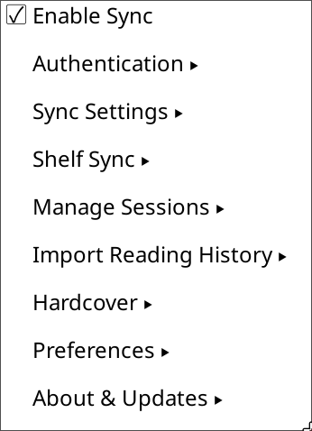

+++
title = "Configuration"
description = "All configuration options for the BookLore Sync plugin."
sort_by = "weight"
weight = 20
template = "section.html"
+++

# Configuration

All plugin settings are accessed from:

**Tools → BookLore Sync → Settings**

Settings are organised into these sub-menus:

| Sub-menu | What it controls |
|----------|-----------------|
| [Authentication](@/configuration/authentication.md) | Server URL and login credentials for both the KOReader sync endpoint and the BookLore API |
| [Sync Settings](@/configuration/session-tracking.md) | Session Settings, Ratings, Annotations, and sync triggers |
| [Manage Sessions](@/configuration/manage-sessions.md) | Manual sync, pending item counts, unmatched book resolution, and local cache details |
| [Import Reading History](@/features/session-tracking.md) | One-time extraction and matching of historical sessions from KOReader's statistics database |
| [Preferences](@/configuration/preferences.md) | Notifications, logging level, and other plugin behaviour |
| About & Updates | Plugin version information and update management |

All settings are stored in a local SQLite database at `{your_koreader_installation}/settings/booklore-sync.sqlite` and persist across KOReader restarts. No configuration file needs to be edited manually.
